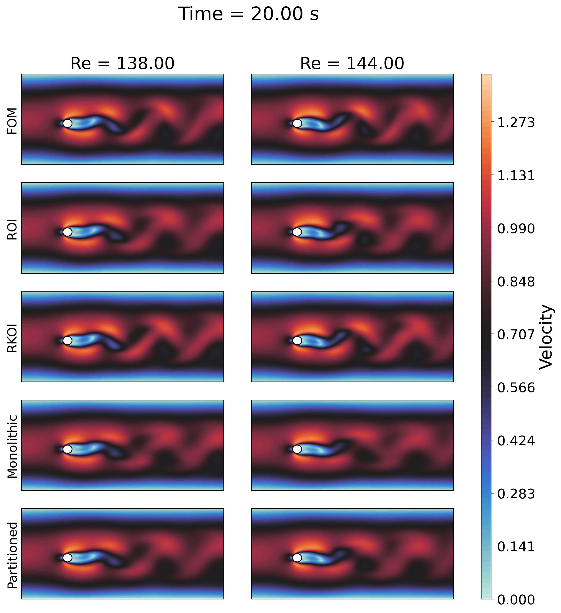
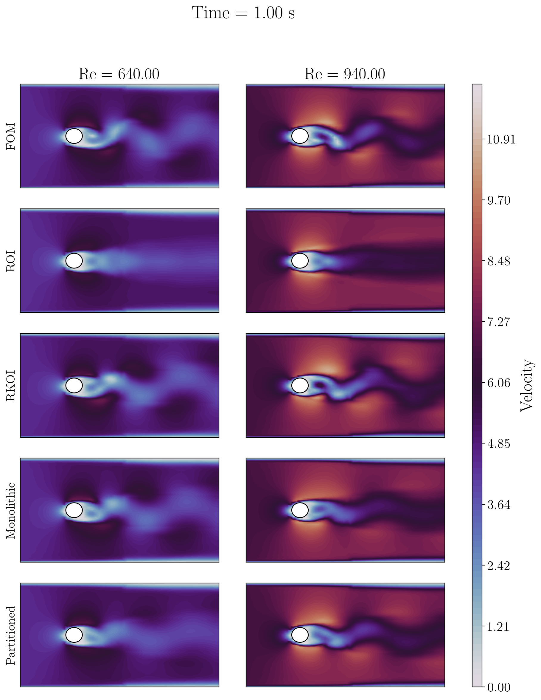

# ParametricDMD
Parametric Dynamic Mode Decomposition for model discovery of dynamical systems.

This repository collects some code implementing Parametric Dynamic Mode Decomposition (Parametric DMD) algorithms as complementary material to the paper:

**S. Riva, A. Missaglia, C. Introini, I. C. Bang, and A. Cammi, “A Comparison of Parametric Dynamic
Mode Decomposition Methods for Nuclear Reactors Applications,” 2025**

The following test cases are provided:

1. RELAP5 model of DYNASTY, natural circulation loop at Politecnico di Milano
2. a laminar flow over cylinder (Reynolds between 100 and 150) generated with [dolfinx-v6](https://github.com/FEniCS/dolfinx) using [OFELIA solvers](https://github.com/ERMETE-Lab/MP-OFELIA)
3. flow over cylinder from CFDbench

---

The code is written in Python and uses the following libraries:

- `numpy`
- `scipy`
- `matplotlib`
- `tqdm`
- `scikit-learn`
- `pydmd` [https://github.com/PyDMD/PyDMD](https://github.com/PyDMD/PyDMD)
- `imageio.v2`

----------------

### Flow over cylinder - dolfinx-v6

  
   

### Flow over cylinder - CFDbench

  
   
 -->

### RELAP5 model of DYNASTY, natural circulation loop at Politecnico di Milano

  
   

<!-- GIF

  
   

 -->
