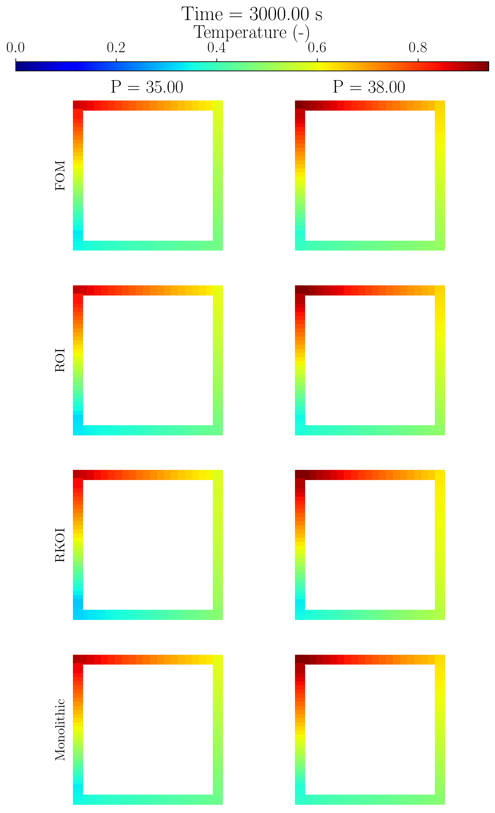

# ParametricDMD
Parametric Dynamic Mode Decomposition for model discovery of dynamical systems.

This repository collects some code implementing Parametric Dynamic Mode Decomposition (Parametric DMD) algorithms as complementary material to the paper:

**S. Riva, A. Missaglia, C. Introini, I. C. Bang, and A. Cammi, “A Comparison of Parametric Dynamic Mode Decomposition Algorithms for Thermal-Hydraulics Applications,” Mar. 2025. [arXiv:2503.24205](https://arxiv.org/abs/2503.24205) [math]**

The following test cases are provided:

1. Laminar flow over cylinder (Reynolds between 100 and 150) generated with [dolfinx-v6](https://github.com/FEniCS/dolfinx) using [OFELIA solvers](https://github.com/ERMETE-Lab/MP-OFELIA)
2. Flow over cylinder from CFDbench benchmark for Machine Learning
3. RELAP5 model of DYNASTY, a natural circulation loop deployed at Politecnico di Milano (see [Riva et al. (2024) - NUTHOS14 Conference](https://www.researchgate.net/publication/384146697_A_Novel_Approach_for_Parametric_Dynamic_Mode_Decomposition_application_to_the_DYNASTY_Experimental_Facility))

The data can be downloaded from [Zenodo](https://doi.org/10.5281/zenodo.15111287).

---

The code is written in Python and uses the following libraries:

- `numpy`
- `scipy`
- `matplotlib`
- `pandas`
- `tqdm`
- `scikit-learn`
- `ezyrb`
- `pydmd` [https://github.com/PyDMD/PyDMD](https://github.com/PyDMD/PyDMD)
- `imageio.v2`

----------------

### Flow over cylinder - dolfinx-v6

<!--

  
    -->

### Flow over cylinder - CFDbench

<!-- 

  
   
 -->

### RELAP5 model of DYNASTY, natural circulation loop at Politecnico di Milano

<!-- 

  
   

 -->
